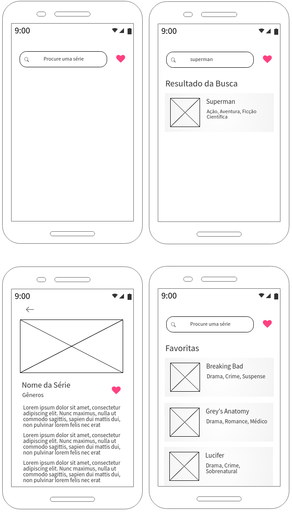

Aplicativo utilizando a [API TV Maze](https://www.tvmaze.com/api).

Para executar o aplicativo:
  Utilizar o comando "npm install".
  Utilizar o comando "react-native run-android" "ou react-native run-ios"